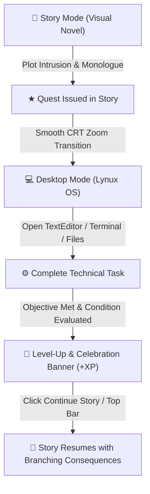

# 🐱 Lynux Caracal

> **A Hybrid Cyberpunk Visual Novel & Simulated Desktop Operating System Game Engine**  
> Built with [Love2D (Lua)](https://love2d.org/) • Featuring a Retro Yellow Gaming / Kawaii Aesthetic • Smooth 60 FPS Architecture

---

## 🌟 Overview

**Lynux Caracal** is a hybrid narrative game that seamlessly switches between **Storytelling Mode (Visual Novel)** and the **Protagonist's Personal Computer (Lynux OS Desktop Simulation)**.

As the protagonist uncovers encrypted transmissions, decompiles payloads, and faces mysterious network intrusions, the game transitions from atmospheric narrative scenes directly into a fully interactive Linux-like desktop. Players inspect files, edit decrypted ciphers, execute terminal commands, and converse via encrypted chat apps to solve objectives, earn XP, level up their hacker rank, and branch the story.

---

## 🎮 Gameplay Flow



---

## ✨ Features

### 📖 1. Visual Novel & Narrative Engine
- **Atmospheric Monologues & Dialogues**: Clean floating text box with typewriter effects, character-specific colored badges (`♥ Ghost`, `★ Thought`), and ambient typing blips.
- **Branching Choice System**: Interactive option cards with number pills (`[ 1 ]`, `[ 2 ]`, `[ 3 ]`), keyboard navigation (`1-9` / `Up-Down-Enter`), and mouse hover feedback.
- **Dialogue Transcript Backlog**: Scrollable history log overlay toggled with `H` key or scroll wheel.
- **Character Manager**: Configurable character profiles, custom nameplates, colors, and positioning.
- **Decoupled Lua Story Scripts**: Narrative chapters written in declarative Lua script tables.

### 💻 2. Simulated Desktop Operating System (Lynux OS)
- **Retro Traffic-Light Window Chrome**: Draggable, minimizable, and resizable window system with pastel controls (`●` Strawberry Pink Close, `●` Sunny Lemon Minimize, `●` Soda Mint Focus).
- **Direct File Opening**: Single/double-clicking files on the desktop or in the **Files App** automatically launches and loads them directly into **TextEditor** or the appropriate viewer.
- **Top System Status Bar (28px)**:
  - `★ Lynux` brand badge.
  - Player Level progress pill (`♥ Lv. 1 [████░░░░] 0/100 XP`).
  - Active quest tracker pill (`★ Secure Key`).
  - `[ 📖 Story Mode ]` button to return to narrative mode.
  - Real-time digital clock.
- **Pinned Task HUD**: Draggable quest sticky note on the desktop displaying active objectives, live checkmarks `[✓]`, XP reward badge, hint drawer, and a `[ ▶ Continue Story ]` action button.
- **Suite of Integrated Desktop Apps**:
  - 📝 **TextEditor**: Full syntax editing, cursor navigation, unsaved dirty markers, and Ctrl+S saving.
  - 📁 **Files App**: Directory navigation, file browsing, and direct file launching.
  - 💻 **Terminal**: Interactive shell with command execution, pipes, filesystem operations, and inline function substitutions.
  - 💬 **Chat**: Encrypted messaging application with contact threads.
  - ✉️ **Email**: Mail client with unread badges and attachments.
  - 🌐 **Browser**: Minimal browser rendering HTML pages and mock web engines.
  - 🖼️ **ImageViewer** & 🧊 **ObjViewer**: Image previewer and 3D wireframe object inspector.
  - ⚙️ **Settings**: Desktop wallpaper and visual customizer.

### 🏆 3. Task & Level Progression System
- **Event-Driven Task Evaluator**: Condition listeners evaluate actions (e.g. file content matching, terminal commands, story flags).
- **Player Stats & Hacker Ranks**: Earn XP to level up from *Script Novice* $\rightarrow$ *Code Initiator* $\rightarrow$ *Sandbox Breaker*.
- **Celebration Banner**: Animated level-up banner with star insignia, XP rewards, and audio fanfare.

### ⚙️ 4. Professional ESC Pause & Settings Menu
- Accessible anytime in both Story and Desktop modes by pressing `ESC`.
- **Resume Game**: Seamlessly return to gameplay.
- **Switch Story / PC Mode**: Instantly toggle between narrative and desktop modes.
- **Settings & Audio**: Interactive sliders for Master SFX and BGM volume, plus typewriter text speed choices.
- **Reset Chapter**: Safely restart the current story script from step 1.
- **Exit Game**: Clean exit to desktop.

### 🎨 5. Retro Yellow Gaming / Kawaii Aesthetic & 60 FPS Performance
- **Color Palette**:
  - **Base Canvas**: Warm espresso dark slate (`#1e1b18` / `#28231d`)
  - **Sunny Yellow & Honey Gold**: `#ffd166` / `#ffb703`
  - **Kawaii Pastels**: Strawberry Pink (`#ff70a6`), Soda Mint (`#06d6a0`), Warm Cream (`#fffdfa`)
- **Zero Lag**: Optimized geometry rendering and clean scissor clipping running at silky-smooth 60 FPS.

---

## 📁 Clean Codebase Architecture

All source code is strictly structured within `./src/`, leaving only `main.lua` and `conf.lua` in the root:

```
lynux-caracal/
├── main.lua                  -- Root entry point; delegates to GameManager
├── conf.lua                  -- Window resolution (760x480, resizable) & Love2D config
├── README.md                 -- Engine documentation
├── assets/                   -- App icons and UI graphics
├── audio/                    -- Music and sound assets
├── data/
│   ├── filesystem.json       -- Virtual OS filesystem template
│   └── stories/
│       └── prologue.lua      -- Chapter 1 narrative and quest script
├── font/                     -- TrueType fonts
├── lib/                      -- JSON, XML, and helper libraries
├── src/
│   ├── core/
│   │   ├── game_manager.lua  -- Master state machine & lifecycle coordinator
│   │   ├── event_bus.lua     -- Global pub/sub messaging bus
│   │   ├── player_stats.lua  -- Player XP, level, title, and persistent flags
│   │   ├── audio_manager.lua -- Procedural sound synth fallbacks & audio playback
│   │   ├── transitions.lua   -- CRT zoom, glitch, and fade mode transitions
│   │   └── filesystem.lua    -- Virtual in-memory hierarchical filesystem
│   ├── story/
│   │   ├── story_engine.lua  -- Narrative script interpreter
│   │   ├── dialogue_box.lua  -- Minimalist dialogue and thought textplate
│   │   ├── choice_box.lua    -- Interactive choice overlay cards
│   │   ├── scene_view.lua    -- Background scenery renderer
│   │   ├── character_mgr.lua -- Character portraits, tags, and colors
│   │   └── history_log.lua   -- Dialogue transcript backlog
│   ├── desktop/
│   │   ├── desktop_mgr.lua   -- Desktop background, icons, dock, and start menu
│   │   ├── window_mgr.lua    -- Window chrome, input routing, and focus handling
│   │   ├── taskbar.lua       -- 28px top status bar
│   │   ├── task_hud.lua      -- Draggable quest tracker sticky note
│   │   └── notifications.lua -- Toast notification cards
│   ├── tasks/
│   │   ├── task_manager.lua  -- Quest lifecycle and celebration banner
│   │   └── task_conditions.lua-- Condition evaluators (e.g. fileContentContains)
│   ├── ui/
│   │   └── pause_menu.lua    -- Professional ESC pause & settings menu
│   └── apps/                 -- Standalone desktop applications
│       ├── browser.lua
│       ├── chat.lua
│       ├── email.lua
│       ├── files.lua
│       ├── imageviewer.lua
│       ├── objviewer.lua
│       ├── settings.lua
│       ├── terminal.lua
│       ├── terminal_commands.lua
│       ├── tessarect.lua
│       ├── texteditor.lua
│       └── websites.lua
```

---

## 🛠️ Story Scripting Guide

Stories are written as declarative Lua arrays in `data/stories/*.lua`.

### Example Script (`data/stories/chapter1.lua`):

```lua
local TaskConditions = require("src.tasks.task_conditions")

return {
    -- 1. Set Background Scene
    { type = "bg", name = "bedroom_night" },

    -- 2. Internal Monologue
    { type = "monologue", text = "02:43 AM. A strange packet hit my firewall on port 8080." },
    { type = "monologue", text = "The decrypted key is 'DELTA-99'. I must secure it on my desktop." },

    -- 3. Issue Quest Objective
    {
        type = "task",
        task = {
            id = "save_key",
            title = "Secure the Key",
            desc = "Create a file named 'cipher.txt' in your home directory containing 'DELTA-99'.",
            hint = "Launch TextEditor from the dock, type 'DELTA-99', and save as 'cipher.txt'.",
            xp = 100,
            condition = TaskConditions.fileContentContains("home/cipher.txt", "DELTA-99"),
            onComplete = function(task)
                local Notifications = require("src.desktop.notifications")
                Notifications.add("Ghost (Encrypted)", "I see you secured the cipher. Not bad.")
            end
        }
    },

    -- 4. Transition to Desktop Mode
    { type = "switch_mode", mode = "desktop", transition = "crt_zoom" },

    -- 5. Narrative Resumption after Quest
    { type = "label", name = "post_task" },
    { type = "say", speaker = "Ghost", text = "You're fast with that keyboard. Who taught you to code?" },

    -- 6. Branching Choices
    {
        type = "choice",
        prompt = "How do you respond to Ghost?",
        options = {
            { text = "Demand to know who they work for", target = "branch_demand" },
            { text = "Ask what they want with DELTA-99", target = "branch_ask" }
        }
    },

    -- Branch Targets
    { type = "label", name = "branch_demand" },
    { type = "say", speaker = "Ghost", text = "I don't have a master, and neither should you." },
    { type = "jump", target = "conclusion" },

    { type = "label", name = "branch_ask" },
    { type = "say", speaker = "Ghost", text = "DELTA-99 is the override key to Caracal Corp." },
    { type = "jump", target = "conclusion" },

    { type = "label", name = "conclusion" },
    { type = "monologue", text = "The connection abruptly severed..." }
}
```

### Available Story Step Types:
| Step Type | Arguments | Description |
|---|---|---|
| `monologue` / `thought` | `text` | Displays internal thought plate with `★ Thought` badge |
| `say` | `speaker`, `text` | Character dialogue with custom colored nameplate |
| `bg` | `name` | Changes the scene backdrop (`bedroom_night`, `server_room`) |
| `task` | `task` | Registers a quest with conditions and XP rewards |
| `switch_mode` | `mode`, `transition` | Switches mode (`story` $\leftrightarrow$ `desktop`) with transition (`crt_zoom`, `fade`) |
| `choice` | `prompt`, `options` | Presents interactive choice cards with branch targets |
| `label` | `name` | Defines a jump destination |
| `jump` | `target` | Jumps execution to a label |
| `flag` | `name`, `value` | Sets a persistent narrative flag |
| `sfx` | `name`, `pitch`, `vol` | Plays a sound effect |

---

## ⌨️ Controls & Keybindings

### 📖 Storytelling Mode
| Action | Keybinding | Mouse |
|---|---|---|
| Advance Dialogue | `Space` / `Enter` / `Z` | Left Click |
| Auto-Play Toggle | `A` | — |
| Dialogue Backlog | `H` / `L` | Right Click / Scroll Up |
| Quick PC Mode Check | `Tab` | — |
| **Pause & Settings Menu** | **`ESC`** | — |

### 💻 Desktop OS Mode
| Action | Keybinding | Mouse |
|---|---|---|
| Launch App | — | Click Dock Icon |
| Open Desktop File | — | Click Desktop Icon |
| Move / Drag Window | — | Drag Window Titlebar |
| Resize Window | — | Drag Bottom-Right Grip |
| Minimize / Close Window | — | Click Window Controls (`● ● ●`) |
| Save File in Editor | `Ctrl + S` | Click Save Icon / Header |
| Stand Up / Return to Story | `Tab` | Click `[ 📖 Story Mode ]` or Task HUD |
| **Pause & Settings Menu** | **`ESC`** | — |

---

## 🚀 Installation & Running

### Requirements
- [Love2D](https://love2d.org/) version 11.0 or higher.

### Run Directly:
```bash
# From the root directory of the project:
love .
```

---

## 📜 License & Credits
- **Engine**: Lynux Caracal
- **Framework**: Love2D (Lua)
- **Built for**: Interactive storytelling, hacking simulation games, and visual novel hybrids.
