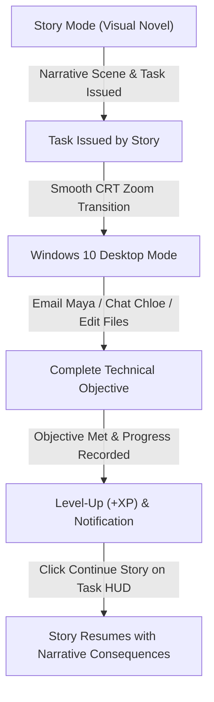

# 🐱 Lynux Caracal

> **A Hybrid Narrative Visual Novel & Simulated Desktop Operating System Game Engine**  
> Built with [Love2D (Lua)](https://love2d.org/) • Windows 10 Style Desktop Interface • Material Dark Aesthetic • 60 FPS Architecture

---

## 🌟 Overview

**Lynux Caracal** is a hybrid narrative game that seamlessly switches between **Storytelling Mode (Visual Novel)** and the **Protagonist's Personal Computer (Windows 10 Style Desktop Simulation)** set in a grounded 2009–2010 atmosphere.

The gameplay and mode transitions are **strictly narrative-driven**: as the story progresses, the narrative naturally sends the player to their PC to complete real computing tasks (e.g. reading emails, chatting with contacts, editing cipher files, executing terminal commands), then transitions back to the visual novel when objectives are fulfilled.

---

## 🎮 Gameplay Flow



---

## ✨ Features

### 📖 1. Visual Novel & Narrative Engine
- **Atmospheric Monologues & Dialogues**: Clean Material dark glass plate with soft drop shadows and zero distracting borders.
- **Branching Choice System**: Clean Material option cards with number prefixes (`1.`, `2.`, `3.`) and Windows Accent Blue selection highlights.
- **Dialogue Transcript Backlog**: Scrollable history log overlay toggled with `H` or `L` keys.
- **Rich 2009–2010 Storyline**:
  - **Task 1 (Sister's Email)**: Open the Email app and read Maya's message about Mom's 50th birthday.
  - **Task 2 (Girlfriend Chat)**: Open Chat and reply to Chloe's late-night message.
  - **Task 3 (The Cipher Intrusion)**: A network packet arrives on port 8080. Decrypt the key and save `DELTA-99` in `cipher.txt` using TextEditor.
  - **Scene 4 (Ghost Confrontation)**: Face off against the mysterious hacker entity `Ghost` with branching dialogue choices.

### 🪟 2. Windows 10 Style Desktop Operating System
- **Multi-Process App Management**:
  - Supports running **multiple concurrent instances / windows of the same app** (e.g., editing `cipher.txt` and `notes.txt` in separate TextEditor windows).
  - Each window has its own unique Process ID (`pid`), state, coordinate offsets, and active focus.
  - Taskbar tabs display multi-instance counter badges.
- **Windows 10 Chrome & Controls**:
  - Flat dark titlebars with app icon and title.
  - Standard top-right controls: Minimize (`—`), Maximize (`□`), and Close (`✕` which turns bright Windows Red `#e81123` on hover).
  - 1px Windows Accent Blue (`#0078d4`) focus border.
- **Bottom Taskbar (38px)**:
  - Windows 4-square Start button and Start Menu with application drawer.
  - Search box mockup (`"Type here to search"`).
  - Active underline indicators on running app tabs.
  - System tray with real-time digital clock (`12:43 AM`), date (`08/31/2010`), and Player Level/XP progress badge.
- **Desktop Widgets & Apps**:
  - 📋 **Task HUD**: Clean Windows 10 Sticky Note / Objectives card with live checkmarks and `"Continue Story"` button.
  - 🔔 **Action Center Notifications**: Windows 10 toast popups in the bottom-right corner.
  - 📝 **TextEditor**: Multi-instance file editing, dirty flags, saving, and line numbering.
  - 📁 **Files App**: Directory navigation and direct file launching.
  - 💻 **Terminal**: Interactive shell with command execution and filesystem commands.
  - 💬 **Chat**: Messaging app with multiple contacts (Chloe, Alice, Bob, etc.).
  - ✉️ **Email**: Mail client with inbox filtering and unread indicators.
  - 🌐 **Browser**, 🖼️ **ImageViewer**, 🧊 **ObjViewer**, ⚙️ **Settings**.

### 🔤 3. Standard Fonts & Crisp Typography
- **UI & Dialogue Body**: `font/Nunito-Regular.ttf` (size 14–15px) for clear readability.
- **Headers & Window Titles**: `font/IBMPlexSans-Bold.ttf` (size 15–16px) for bold titles.
- **Monospace Code / Terminal**: `font/consola.ttf` for terminal and code editors.
- **Zero Emojis**: Replaced all emoji symbols across the entire game with clean, professional vector geometry and labels.

### ⚙️ 4. Professional ESC Pause & Settings Menu
- Accessible anytime in both Story and Desktop modes by pressing `ESC`.
- **Resume Game**: Seamlessly return to current gameplay.
- **Settings & Audio**: Interactive sliders for SFX and Music volume, plus typewriter text speed options.
- **Restart Chapter**: Re-initialize the current story chapter.
- **Exit to Desktop**: Cleanly quit the application.

---

## 📁 Clean Codebase Architecture

All source code is strictly organized in `./src/`, keeping only `main.lua` and `conf.lua` in the root:

```
lynux-caracal/
├── main.lua                  -- Root entry point; delegates to GameManager
├── conf.lua                  -- Window resolution (760x480, resizable) & Love2D config
├── README.md                 -- Engine documentation
├── assets/                   -- App icons and UI graphics
├── audio/                    -- Music and sound assets
├── data/
│   ├── filesystem.json       -- Virtual OS filesystem template
│   └── stories/
│       └── prologue.lua      -- Chapter 1 narrative and quest script
├── font/                     -- Standard TrueType fonts (Nunito, IBMPlexSans, consola)
├── lib/                      -- JSON, XML, and helper libraries
├── src/
│   ├── core/
│   │   ├── game_manager.lua  -- Master state machine & lifecycle coordinator
│   │   ├── event_bus.lua     -- Global pub/sub messaging bus
│   │   ├── player_stats.lua  -- XP, levels, hacker ranks, and narrative flags
│   │   ├── audio_manager.lua -- SFX and background music controller
│   │   ├── filesystem.lua    -- Virtual in-memory filesystem engine
│   │   └── transitions.lua   -- CRT zoom and fade screen transitions
│   ├── story/
│   │   ├── story_engine.lua  -- Visual novel script interpreter
│   │   ├── dialogue_box.lua  -- Material dialogue renderer (no borders)
│   │   ├── choice_box.lua    -- Branching choice renderer
│   │   ├── history_log.lua   -- Backlog transcript overlay
│   │   ├── character_mgr.lua -- Character profiles and nametags
│   │   └── scene_view.lua    -- 2009-2010 bedroom and environment scenes
│   ├── desktop/
│   │   ├── desktop_mgr.lua   -- Desktop wallpaper, icons, and Start Menu
│   │   ├── window_mgr.lua    -- Multi-process window chrome and event routing
│   │   ├── taskbar.lua       -- Windows 10 bottom taskbar and system tray
│   │   ├── task_hud.lua      -- Sticky Note objective tracker
│   │   └── notifications.lua -- Windows Action Center toast notifications
│   ├── tasks/
│   │   ├── task_manager.lua  -- Quest lifecycle and level-up banners
│   │   └── task_conditions.lua -- Evaluators for files, emails, and chats
│   ├── apps/                 -- Desktop applications (TextEditor, Email, Chat, Files, etc.)
│   ├── ui/
│   │   └── pause_menu.lua    -- ESC Pause and Settings menu
│   └── test_verify.lua       -- Automated verification test suite
```

---

## 🕹️ Controls

| Context | Key / Action | Description |
|---|---|---|
| **Anywhere** | `ESC` | Open / Close Pause & Settings Menu |
| **Story Mode** | `Space` / `Enter` / `Left Click` | Advance dialogue / Complete typing |
| **Story Mode** | `1`, `2`, `3` / `Click` | Select dialogue choice |
| **Story Mode** | `H` / `L` | Toggle dialogue history backlog |
| **Desktop** | `Left Click` | Focus / Launch / Interact with app windows & icons |
| **Desktop** | `Right Click` on Dock | Launch new process instance of application |
| **Desktop** | `Window Titlebar Drag` | Move window |
| **Desktop** | `Window Bottom-Right Drag` | Resize window |
| **Task HUD** | `Click Continue Story` | Return to visual novel after completing task |

---

## 🚀 Running the Game

Launch with Love2D:
```bash
love .
```
