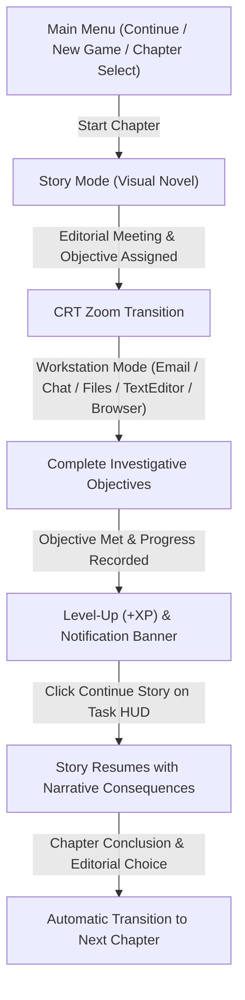

# 📰 Daydream Newspaper Club

> **A Hybrid Narrative Visual Novel & Simulated Desktop Operating System Game Engine**  
> Built with [Love2D (Lua)](https://love2d.org/) • Windows 10 Style Desktop Interface • Material Dark Aesthetic • 60 FPS Architecture

---

## 🌟 Overview

**Daydream Newspaper Club** is a hybrid narrative game that seamlessly switches between **Storytelling Mode (Visual Novel)** and the **Protagonist's Personal Computer (Windows 10 Style Desktop Simulation)** set in the warm, nostalgic atmosphere of Kamiyama High School.

The player assumes the role of **Aki Akizuki**, lead layout editor of the Kamiyama High Newspaper Club. Facing an impending budget audit by the Student Council, Aki must work alongside Vice President **Suzumia**, President **Nagahashi**, and tech specialist **Hoshida** to assemble the ultimate Dual-Cover Autumn Special Edition while uncovering an unauthorized proxy server operating inside the school's old 3rd floor repeater network.

Gameplay transitions are **strictly narrative-driven**: the visual novel story naturally directs the player to their workstation to complete real computing tasks (downloading email attachments, editing review drafts in TextEditor, researching cat cafe menus in Browser, chatting with club members, and isolating network ciphers), then returns to the visual novel when objectives are fulfilled.

---

## 🎮 Gameplay Flow



---

## ✨ Key Features

### 📖 1. Visual Novel & Narrative Engine
- **Atmospheric Storytelling**: Clean Material dark glass dialogues with zero distracting borders and crisp typography.
- **Modular Chapter Architecture**:
  - **Chapter 1 ("Ink, Whiskers & The Midnight Repeater")**: Editorial deadlock in Clubroom 204, cat cafe draft investigation, and isolating the 3rd floor repeater anomaly.
  - **Chapter 2 ("The Morning Commute & The Basement Sub-Station")**: Morning walk with Hiko, Auditor Saeki's 17:00 deadline, and tracing the basement physical mesh node.
- **Branching Choice System**: Meaningful editorial decisions that influence the tone and focus of the club's publication.
- **Dialogue Transcript Backlog**: Full scrollable dialogue history toggled with `H` or `L` keys.

### 🪟 2. Windows 10 Style Desktop Operating System
- **Multi-Process App Management**:
  - Run multiple concurrent instances of applications with unique Process IDs (`pid`).
  - Taskbar tabs feature running indicators and instance count badges.
- **Desktop Applications**:
  - ✉️ **Email Client**: Progressive email unlocking, folder filtering, and interactive email attachment downloading (`cat_cafe_review.txt`).
  - 💬 **Chat App**: Scripted narrative auto-text messaging with realistic typing delays.
  - 📝 **TextEditor**: Syntax highlighting, file saving (`Ctrl+S`), line numbering, and dirty flags.
  - 🌐 **Browser**: Web navigation (`http://meowlatte.com`) with tabbed browsing.
  - 📁 **Files App**: Directory navigation across `/home/user/Downloads`, `/home/user/Documents`, etc.
  - 💻 **Terminal**: Interactive shell with filesystem commands (`ls`, `cat`, `help`, `quarantine`).
  - 📋 **Task HUD**: Clean sticky note objective tracker with live checkmarks and `"Continue Story"` button.
  - 🔔 **Action Center**: System toast notifications.

### 🎵 3. Original Soundtrack & Audio Design
- **`audio/bgm/main_menu.mp3`**: Elegant, atmospheric BGM for the Main Menu and Story Visual Novel scenes.
- **`audio/bgm/desktop.mp3`**: Warm, ambient electronic OST for Workstation Desktop mode and cafe scenes.
- **Procedural Sound Effects**: Typewriter blips, UI clicks, task completed fanfares, and level-up chimes.

### 💾 4. Persistent Auto-Save System
- Progress (story position, player level/XP, completed tasks, flags, unlocked emails, chat states, and filesystem) automatically saves upon task completion, story choices, and chapter transitions.
- Supports resuming from the Title Screen with **Continue**.

---

## 📁 Source Code Structure

```
daydream-newspaper-club/
├── main.lua                  -- Root Love2D entry point
├── conf.lua                  -- Window resolution (760x480, resizable) & title config
├── README.md                 -- Project documentation
├── audio/
│   ├── bgm/                  -- Background music tracks (main_menu.mp3, desktop.mp3)
│   └── sfx/                  -- Sound effects
├── font/                     -- Standard TrueType fonts (Nunito, IBMPlexSans, consola)
├── lib/                      -- JSON and helper libraries
├── src/
│   ├── core/
│   │   ├── game_manager.lua  -- State machine (Menu <-> Story <-> Desktop)
│   │   ├── save_manager.lua  -- Persistent save and restore system
│   │   ├── audio_manager.lua -- BGM and SFX audio controller
│   │   ├── player_stats.lua  -- XP, levels, and narrative flags
│   │   ├── filesystem.lua    -- Virtual in-memory filesystem engine
│   │   └── event_bus.lua     -- Global pub/sub event bus
│   ├── chapters/
│   │   ├── chapter_manager.lua -- Chapter registry, selector, and loader
│   │   ├── chapter_1.lua     -- Chapter 1 narrative and 8-task quest chain
│   │   └── chapter_2.lua     -- Chapter 2 narrative and basement traceroute
│   ├── story/
│   │   ├── story_engine.lua  -- Script interpreter and step dispatcher
│   │   ├── dialogue_box.lua  -- Material dialogue renderer
│   │   ├── choice_box.lua    -- Branching choice selector
│   │   └── history_log.lua   -- Dialogue backlog transcript overlay
│   ├── desktop/
│   │   ├── desktop_mgr.lua   -- Workstation wallpaper, icons, and Start Menu
│   │   ├── window_mgr.lua    -- Multi-window process manager
│   │   ├── taskbar.lua       -- Windows 10 bottom taskbar
│   │   ├── task_hud.lua      -- Objective tracker sticky note
│   │   └── notifications.lua -- Toast notification popups
│   ├── tasks/
│   │   ├── task_manager.lua  -- Task lifecycle and level-up banners
│   │   └── task_conditions.lua -- Evaluators for files, emails, downloads, chats
│   ├── apps/                 -- Desktop applications (Email, Chat, TextEditor, Browser, Files, Terminal)
│   └── ui/
│       ├── main_menu.lua     -- Responsive startup Title Screen
│       └── pause_menu.lua    -- In-game ESC pause and settings menu
```

---

## 🕹️ Controls

| Context | Key / Action | Description |
|---|---|---|
| **Anywhere** | `ESC` | Open / Close Pause & Settings Menu / Back |
| **Main Menu** | `Up` / `Down` / `Enter` / `Click` | Navigate & activate menu options |
| **Story Mode** | `Space` / `Enter` / `Left Click` | Advance dialogue / Complete typewriter text |
| **Story Mode** | `1`, `2`, `3` / `Click` | Select branching dialogue option |
| **Story Mode** | `H` / `L` | Toggle dialogue backlog history |
| **Desktop** | `Left Click` | Focus, launch, and interact with app windows & icons |
| **Desktop** | `Right Click` on Dock | Launch new process instance of application |
| **Desktop** | `Window Titlebar Drag` | Move active window |
| **Desktop** | `Window Bottom-Right Drag` | Resize active window |
| **Task HUD** | `Click Continue Story` | Return to visual novel after completing task |

---

## 🚀 Running the Game

Launch with Love2D (v11+):
```bash
love .
```
